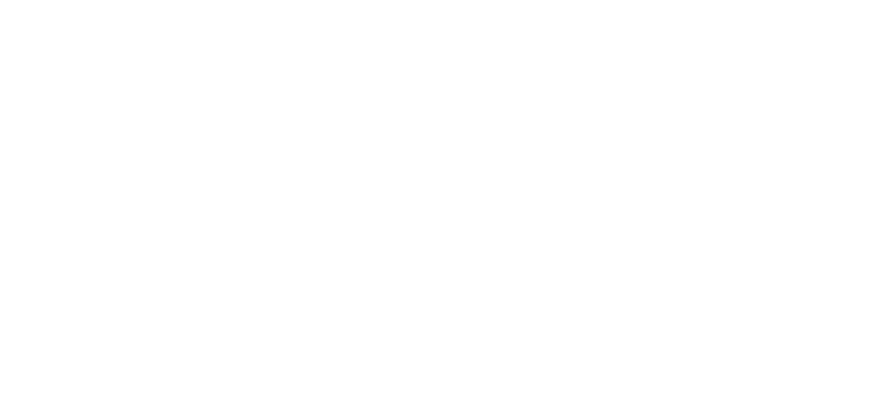

---

Fanmade concept website for [Hextermina](https://hextermina.com) — a dark Y2K indie clothing brand. This project is a non-commercial, creative reinterpretation of the brand’s digital presence. It is not affiliated with, endorsed by, or intended for commercial use by the original brand.

> **Disclaimer:** Fan project only. No products are sold here. All brand references belong to their respective owners.

## About

Hextermina sits at the intersection of underground streetwear and early-internet aesthetics: chrome logos, gate imagery, limited-run drops, and a single-page entry sequence. The site prioritizes atmosphere — sound, motion, and scroll — over traditional e-commerce patterns.

After the intro flow, the main experience is a full-viewport, section-snapped scroll surface built with Lenis: each drop block fills the screen, with parallax chrome accents and scrambled text reveals on scroll.

**Brand tone:** cryptic, dark, indie. Copy leans into “the end,” chrome-era pieces, and small-batch exclusivity.

## What's included

| Layer | Stack |
| --- | --- |
| Framework | [Next.js 16](https://nextjs.org) (App Router, RSC, Turbopack) |
| UI | [React 19](https://react.dev) + [shadcn/ui v4](https://ui.shadcn.com) (`base-luma`, neutral palette, [@base-ui/react](https://base-ui.com)) |
| Styling | [Tailwind CSS v4](https://tailwindcss.com) |
| Motion | [Motion](https://motion.dev) |
| Scroll | [Lenis](https://lenis.darkroom.engineering) |
| Shaders | [@paper-design/shaders-react](https://github.com/paper-design/shaders) (`LiquidMetal` logo) |
| Icons | [Hugeicons](https://hugeicons.com) |
| API | [tRPC v11](https://trpc.io) + [TanStack Query v5](https://tanstack.com/query) |
| Theming | [next-themes](https://github.com/pacocoursey/next-themes) (light / dark / system) |
| Language | TypeScript (strict) |

## Getting started

```bash
git clone git@github.com:jj0han/hextermina.git
cd hextermina
pnpm install
pnpm dev
```

Open [http://localhost:3000](http://localhost:3000). Use headphones and enable sound for the intended experience.

## Scripts

| Command | Description |
| --- | --- |
| `pnpm dev` | Start dev server with Turbopack |
| `pnpm build` | Production build |
| `pnpm start` | Serve production build |
| `pnpm lint` | Run ESLint with auto-fix |
| `pnpm format` | Format TypeScript/TSX with Prettier |
| `pnpm typecheck` | Run TypeScript without emitting |

## Project structure

```
hextermina/
├── app/
│   ├── api/trpc/[trpc]/route.ts   # tRPC HTTP handler
│   ├── globals.css                # Tailwind + OKLCH theme tokens
│   ├── global-not-found.tsx       # Global 404
│   ├── layout.tsx                 # Root layout, fonts, metadata
│   ├── page.tsx                   # Home → WelcomeCard
│   └── providers.tsx              # Theme, storage, audio, scroll, Lenis, cursor
├── components/
│   ├── ui/                        # shadcn/ui components
│   ├── motion-primitives/
│   │   ├── cursor.tsx             # Morphing cursor primitive
│   │   └── text-scramble.tsx      # Scrambled text reveal on scroll
│   ├── welcome-card.tsx           # Experience orchestrator
│   ├── headphones-notice.tsx      # Session intro
│   ├── on-boarding.tsx            # Terms / brand intro
│   ├── landing.tsx                # Gate + LiquidMetal animation
│   ├── main-experience.tsx        # Snap-scrolled drop sections
│   └── controls.tsx               # Theme, volume, and mute UI
├── context/
│   ├── audio-provider.tsx         # Intro + background audio state
│   ├── cursor-provider.tsx        # Hover targets for morphing cursor
│   ├── lenis-provider.tsx         # Lenis smooth scroll + section snap
│   ├── local-storage-provider.tsx # Onboarding + session flow state
│   ├── scroll-container-provider.tsx # Main scroll container ref
│   └── theme-provider.tsx         # next-themes wrapper + toggle helper
├── hooks/
│   └── use-mobile.ts              # Mobile breakpoint helper
├── lib/
│   └── utils.ts                   # `cn()` and shared utilities
├── public/
│   ├── hex-logo.svg
│   ├── gate-left.png / gate-right.png
│   ├── shuriken.svg
│   └── sounds/                    # intro-sound.ogg, background-sound.ogg
├── utils/
│   └── clipPaths.ts               # Cursor pointer clip-path polygon
└── trpc/                          # Type-safe API (starter scaffold)
```

Path alias `@/*` maps to the project root.

## Theming

Dark mode is the primary look. Theme tokens live in `app/globals.css` as OKLCH CSS variables, wired into Tailwind via `@theme inline`. Use semantic classes (`bg-background`, `text-foreground`, `text-muted-foreground`) so UI stays consistent across light and dark.

- **Default:** `next-themes` with `attribute="class"`; the root `Providers` wrapper sets `defaultTheme="system"`.
- **Toggle:** fixed controls in `components/controls.tsx` (top-right).
- **Fonts:** **Oxanium** for headings (`font-heading`), **Inter** for body (`font-sans`), **Geist Mono** for mono accents (`font-mono`).
- **shadcn preset:** `base-luma` style with a neutral base palette (`components.json`).

## tRPC

The repo includes a tRPC + TanStack Query scaffold from the original starter. The concept site does not rely on it for the entry experience; `app/page.tsx` still prefetches a demo `hello` query. Extend or remove as the fan site grows.

## shadcn/ui

Components live in `components/ui/`. Add more with:

```bash
npx shadcn@latest add dialog
```

Typography helpers are hand-maintained in `components/ui/typography.tsx` (not from the registry).

## Code quality

```bash
pnpm lint && pnpm typecheck
```

ESLint (Next.js + import sorting), Prettier (Tailwind class sorting), TypeScript strict mode.

## Deployment

Works on any Next.js host (e.g. Vercel). Build locally:

```bash
pnpm build
pnpm start
```

## License

Fanmade, non-commercial concept project. Not for sale, resale, or commercial exploitation. Brand assets and naming reference [hextermina.com](https://hextermina.com); adjust or remove if publishing publicly and unsure about rights.
